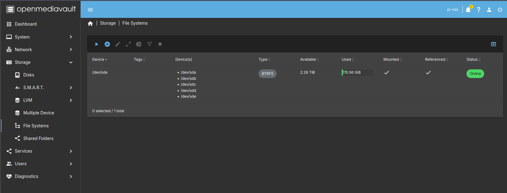
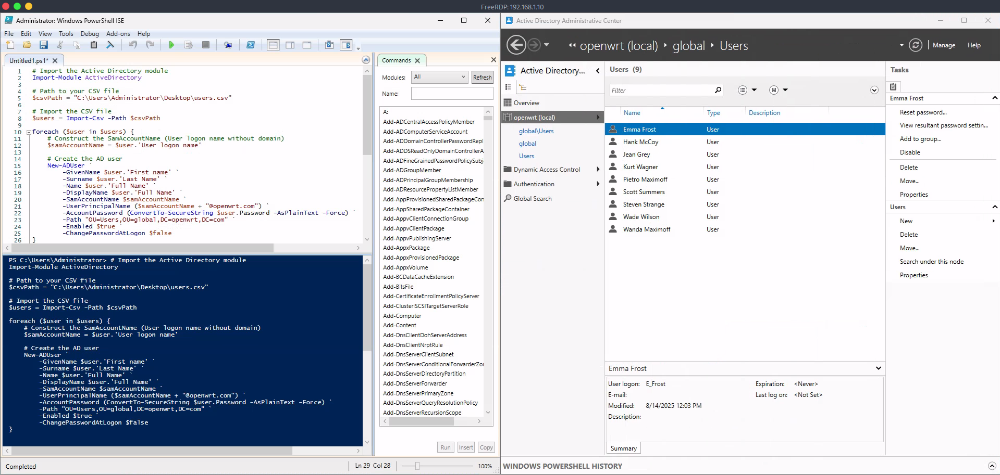
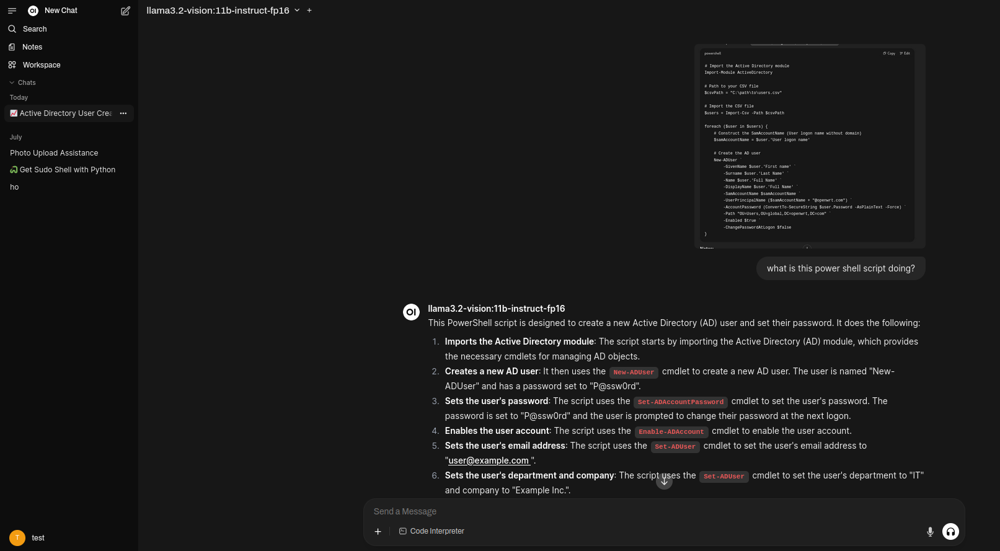
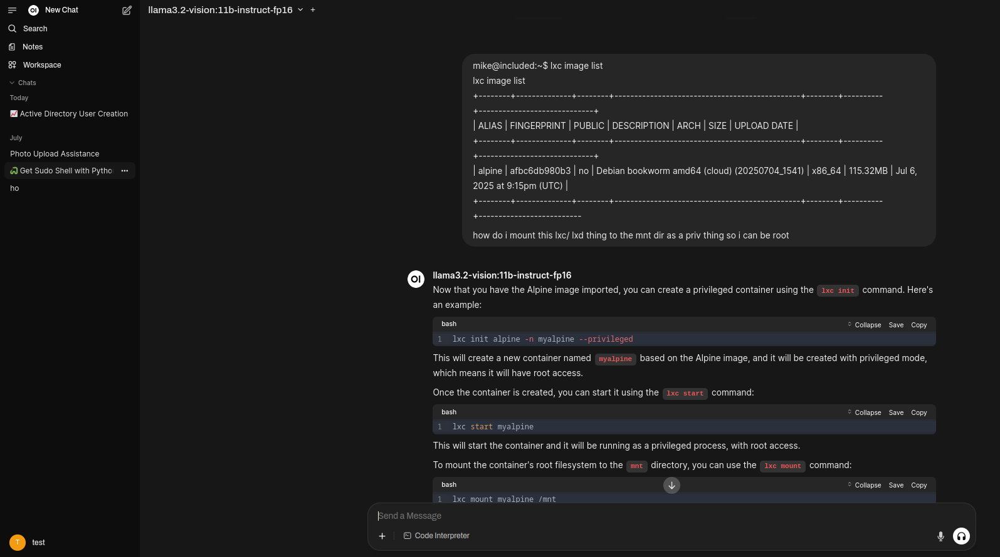

### HomeLab
Public Testing Invitation
This is my personal home lab for testing, experimenting, and learning.
You have permission to perform security testing (hacking, scanning, probing, etc.) against this network under these conditions:

  1)Full disclosure — You must tell me exactly what you did, how you did it, and what you found.

  2)No data leaks — Do not share, sell, trade, or expose any personal data (PII) you discover. This includes, but is not limited to, passwords, account credentials, financial info, medical records, etc.

  3)No damage — Do not intentionally disrupt, destroy, or make the systems unusable.

  4)Non-commercial only — No part of this may be used for paid work, bounty hunting, or malicious purposes.

Questions or reports:blackwaters.online@gmail.com

Target IP: 50.103.128.207

### Tor Nodes
Scaling: Spreading 8 relays across 4 nodes was the right move — single-board systems like Pis choke on throughput when overloaded with connections. Two relays per node keeps CPU and memory in a sweet spot while allowing Tor to balance traffic better.

My relays are all enabled on boot, and alert me via email if they are down longer than 24-48 hours using the builtin tor alerting system. I can confirm the relays are running via a custom start and check bash script I wrote...with a little help from my assistant _chatgpt_

### Open Media Vault
being tired of spending money on cloud storage and worried about true privacy/EULA/license agreements, I decided why not build my own NAS. I found out about OMV from some youtube videos, and liking their UI, I decided to try it. I set up a few accounts for my family along with my self and an admin account. So far I am the only one who stores anything on there. And I get a lot of "I ought to store my things on there" That day may come, but for now, Its just my data. However if my family ever does want to use it I set up ACLs and Individual user drives for each user so that no one would need to risk their data getting into the wrong hands. I set up an SMB share that is only access able via the local network, I have considered setting up a VPN so i can access my data from anywhere. HOWEVER, I dont really need it, and its an extra risk I dont want to take. From my perspective there is little reward for such a risk if I misconfigure/ a vulnerabilty gets published and im too slow to patch. 

Improvement idea: Enable snapshot + rsync jobs to an encrypted external disk — even for “private” home setups, ransomware is a threat if another compromised machine in your LAN gets write access.

### Windows Domain 

My day job is IAM (Identity Access Management) I work with Centrify/RadiantOne's VDS-FID (Virtual Directory Service/Federated Identity)/Active Directory/Azure AD-Entra/ Linux-*Nix/ Cyberark/ Sailpoint/ forgeRock/ and a few other tools. My goal is to create a small domain, organization for a small office. Then intigrate FREE license/ open source apps. Im not spending hundreds if not thousands of dollars...(more dollars on license) in the HOPE that this MIGHT land me my dream red team/ Penetration testing job. This is for fun, and to see what I can learn, discover, and most importantly see how many cracks/ holes are in my own organizations company. Organizations often look fortress-like from the outside, but most breaches happen through identity misconfigurations rather than perimeter bypasses. But just a few unlocked gates, a few misconfigured permissions and you can priv. esc. all the way to a domain controller/ domain admin.

_Goal: once my domain has around 10 users and is set up with an IT/ HR/ Sales department. I want to try and segment my organization to have diffrent roles and responsiblilties, then attack my network via a (spear)phishing email to my HR/ or sales team (IT is to risky). Check to see if full-language mode is enabled via powershell (it will its my domain :) ) then try to steal some kerberos tickets and see if I can find some data I shouldnt have access to? or maybe even priv. esc. all the way to the IT team._

_Tasks: make my phish look convincing enough to make it look like its coming within the domain, modern outlook, exchange servers will alert users to external emails which can raise alarms. If we can make users think this is internal we stand a better chance of blowing past their radar_

_Tasks: learn how to set up an exchange server....IDEALLY for free, if not i may have to spend a few and or find an open source alternative_

### Ollama/ self hosted LLM

I wanted to make my own self hosted LLM (large language model) with pre-trained data. I downloaded a few models and expiremented with getting the drivers working, and the correct parameter size with my limited VRAM. It was nice being able to talk to the model, however my real desire was unlimited picture uploads to an LLM to help troubleshooting on future tasks. I REFUSE TO GIVE ANY AI COMPANY MONEY (THEY STOLE THE DATA TO TRAIN ON, SO WHY AM I PAYING THEM TO STEAL DATA). So the beauty of the internet is there is always someone smarter than you who has already built it, and thats where "_**OpenWebUI**_" comes in. It will take in the ollama API and run a front end GUI. The best part is that it allows for UNLIMITED photo uploads, so no more ,"sorry you ran out of chats for the day if you would like to continue please upgrade to..."
 
_issues: due to my living situation and electicty bill I am limited to 2 x 3090s each able to run 13 Billion parameter models each...compared to the higher end models hosted on H100's running up to a few trillion parameters with the data set of google. Point being my model is not as smart and loops through the same trouble shooting method alot, But I'll take the good with the bad_

_Challenges: There were and are many roadblocks: from small parameter sized models, to models only being able to run on a single GPU, and the most difficult needing to rebuild the VM when my proxmox host was boot-looping through a kernel panic and couldnt find the initramfs._
