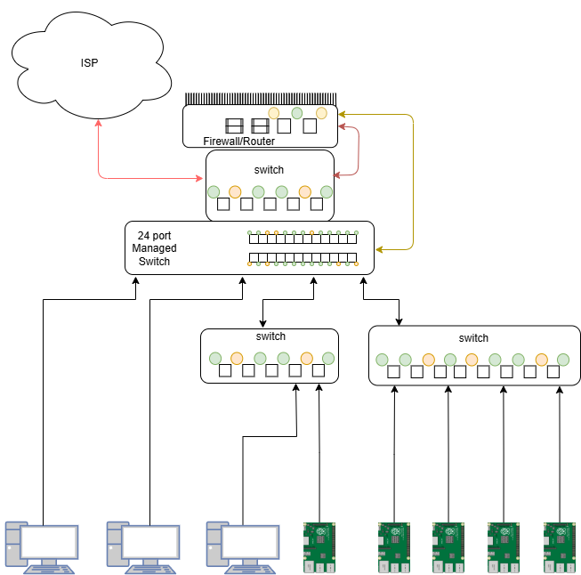
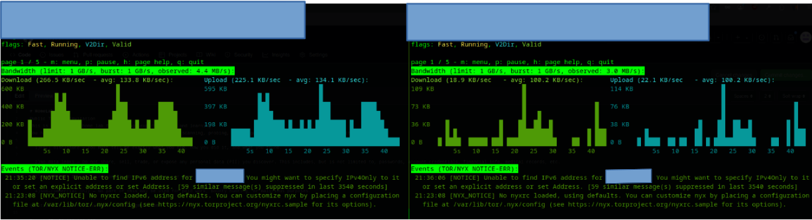

# HomeLab
Public Testing Invitation
This is my personal home lab for testing, experimenting, and learning.
You have permission to perform security testing (hacking, scanning, probing, etc.) against this network under these conditions:

  1)Full disclosure — You must tell me exactly what you did, how you did it, and what you found.

  2)No data leaks — Do not share, sell, trade, or expose any personal data (PII) you discover. This includes, but is not limited to, passwords, account credentials, financial info, medical records, etc.

  3)No damage — Do not intentionally disrupt, destroy, or make the systems unusable.

  4)Non-commercial only — No part of this may be used for paid work, bounty hunting, or malicious purposes.

Questions or reports:blackwaters.online@gmail.com

Target IP: 50.103.128.207

# Tor Nodes
I have 8 relays running on 4 nodes (2 relays per node). I originally had all 8 relays on one Pi, however after discussing with the tor community it seems like the connection speed was abysmal compared to spreading out my relays.

My relays are all enabled on boot, and alert me via email if they are down longer than 24-48 hours using the builtin tor alerting system. I can confirm the relays are running via a custom start and check bash script I wrote...with a little help from my assistant _chatgpt_

# Open Media Vault
being tired of spending money on cloud storage and worried about true privacy/EULA/license agreements, I decided why not build my own NAS. I found out about OMV from some youtube videos, and liking their UI, I decided to try it. I set up a few accounts for my family along with my self and an admin account. So far I am the only one who stores anything on there. And I get a lot of "I ought to store my things on there" That day may come, but for now, Its just my data. However if my family ever does want to use it I set up ACLs and Individual user drives for each user so that no one would need to risk their data getting into the wrong hands. I set up an SMB share that is only access able via the local network, I have considered setting up a VPN so i can access my data from anywhere. HOWEVER, I dont really need it, and its an extra risk I dont want to take. From my perspective there is little reward for such a risk if I misconfigure/ a vulnerabilty gets published and im too slow to patch. 
